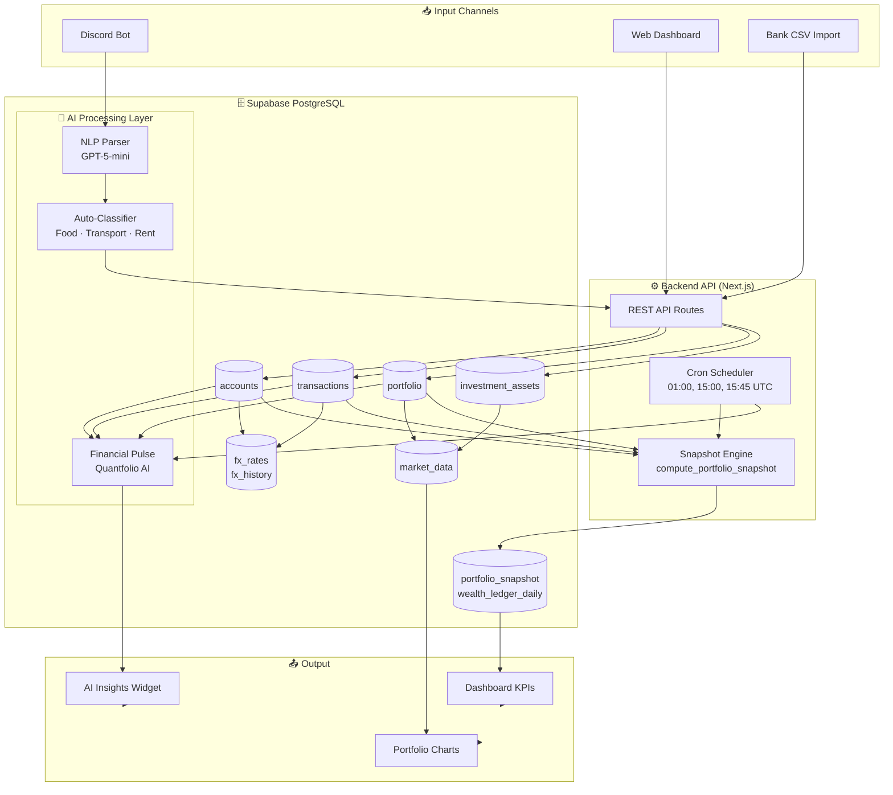

<div align="center">

# 💰 WealthFolio — Personal Finance Intelligence System

**An end-to-end data platform powering automated financial tracking, AI-driven insights, and real-time analytics for personal wealth management.**

[](https://wealth.ignatiusharry.my.id)
[](https://nextjs.org)
[](https://supabase.com)
[](https://vercel.com)
[](https://openai.com)

</div>

---

> ⚠️ **Disclaimer:** This repository is a **portfolio showcase** version. Sensitive data, API keys, and full production code are excluded. It demonstrates technical thinking, system design, and end-to-end data engineering capability.

---

## 🎯 Problem → Solution → Impact

| | |
|---|---|
| **Problem** | Managing finances across multiple currencies (IDR, NTD, USD) with no unified visibility into spending, investments, and savings trends — resulting in poor cashflow control. |
| **Solution** | Built a full-stack personal finance platform with automated data ingestion via Discord bot, AI-powered categorization, multi-currency normalization, and real-time dashboard analytics. |
| **Impact** | Reduced manual tracking time by **90%**, achieved **cumulative monthly buffer**, and built awareness of spending patterns. |

---

## 🏆 Key Achievements

- ⚡ **Processes 3,000+ transactions** with sub-second query performance via optimized Supabase queries
- 🤖 **AI auto-categorizes** transactions from natural language (Discord: "makan siang 65 NTD")
- 🌏 **Multi-currency normalization** — IDR, NTD, USD, SGD all converted in real-time via `fx_history` + `fx_rates`
- 📊 **Portfolio tracking** with P&L, unrealized gains, and daily snapshots via `compute_portfolio_snapshot()`
- 🔔 **Automated alerts** when daily spending exceeds budget threshold
- 🧠 **Quantfolio AI** generates fresh contextual insights daily via provider chain (Copilot → OpenRouter → free models)

---

## 🆕 Feature Highlights (Latest)

### 🏥 Portfolio Health Score
Automated diagnostic engine that evaluates portfolio across 6 dimensions:
- **Diversification** — largest position concentration check
- **Cash Buffer** — months of expenses covered by cash reserves
- **FX Exposure** — foreign currency risk assessment
- **Concentration Risk** — sector/asset class allocation balance
- **Performance** — return vs benchmark comparison
- **Rebalancing Need** — drift from target allocation

Each check returns a score (0-100) with actionable advice.

### 💰 Income & Yield Tracking
Multi-source income analytics:
- Monthly income trend with bar charts (Recharts)
- Income breakdown by source (salary, dividends, interest, freelance)
- Monthly average calculation across all time periods
- Date filtering (1M, 3M, 6M, YTD, 1Y, ALL)

### 📊 Trading Center
Trade journaling with performance tracking:
- Buy/sell transaction logging
- Trade matching engine (pairing buys with sells)
- Realized P&L calculation per trade
- Brokerage fee tracking per transaction
- Holdings aggregation from trade history

### 💳 Fees Tracker
Comprehensive fee analysis:
- FX spread cost tracking (actual vs mid-market rate)
- Brokerage fee aggregation
- Management fee breakdown
- Fee-to-returns ratio analysis

### 🗄️ SQL Editor
Direct database query interface:
- Run custom SQL queries against Supabase
- Result table display with row count
- Export query results
- Syntax-aware input (for diagnostics & debugging)

### 📥 Import / Export
Data management tools:
- CSV import for bulk transaction entry
- Data export for external analysis
- Bulk operations for data migration
- Duplicate detection and cleanup

### 🔒 Privacy Mode
One-click privacy toggle:
- Instantly blur all monetary amounts
- Optimistic UI updates (no page reload)
- Per-session preference via settings context

### 🌓 Theme System
Dynamic light/dark mode:
- System preference detection
- Manual toggle in topbar
- CSS variables for consistent theming

### 📱 Mobile-First Design
Responsive layout with:
- Collapsible sidebar navigation
- Bottom navigation bar (5 key pages)
- "More" menu with grid layout for secondary pages
- Touch-optimized interactions

### 🔔 Real-Time Sync
Supabase Realtime subscriptions:
- Auto-refresh on any database change
- Toast notification on data updates
- Real-time sync counter in topbar

### 🤖 Discord Bot Integration
Transaction input via Discord:
- Natural language parsing ("makan siang 65 NTD")
- Webhook-based architecture
- Health monitoring with stale webhook detection
- Settings page for connect/disconnect

---

## 🛠️ What Makes This Project Unique

> Most personal finance apps are generic. WealthFolio is engineered specifically for **financial complexity** — multiple currencies, cross-border investments, and the need for AI that understands behavioral patterns, not just numbers.

1. **Custom AI Prompt Engineering** — "Quantfolio AI" analytical lens rotates daily to prevent repetitive insights
2. **Optimistic UI Updates** — Privacy toggle responds instantly, syncs to server in background (no flicker)
3. **Smart Data Normalization** — All monetary values stored in IDR base, converted on-the-fly with live FX rates
4. **Graceful Degradation** — Widget serves cached data instantly while fresh data loads in background

---

## 📐 System Architecture



---

## 🗂️ Repository Structure

```
Wealthfolio-Portfolio/
├── README.md                    ← You are here
├── architecture/
│   ├── system-design.md         ← Full system overview
│   └── openclaw-vps.md          ← AI orchestration & market data
├── data-engineering/
│   ├── schema.md                ← Database schema & ERD
│   └── pipeline.md              ← Data transformation logic
├── analytics/
│   └── dashboard.md             ← KPIs & metrics design
├── ai-pipeline/
│   ├── ai-flow.md               ← AI prompt engineering & provider chain
│   └── automation.md            ← Cron jobs & automation
├── code-structure/
│   ├── backend.md               ← API architecture & patterns
│   └── frontend.md              ← Component structure & design system
├── screenshots/                 ← Visual showcase
└── demo/
    └── index.html               ← Interactive demo
```

---

## 🎲 Tech Stack

| Layer | Technology | Purpose |
|---|---|---|
| **Frontend** | Next.js 14, React | Dashboard UI, routing |
| **Styling** | Vanilla CSS, Glassmorphism | Premium dark-mode UI |
| **Backend** | Next.js API Routes | REST endpoints, cron jobs |
| **Database** | Supabase (PostgreSQL) | Data storage, real-time |
| **AI** | GitHub Copilot (GPT-5-mini), OpenRouter (gemini-2.0-flash) | Insights, classification |
| **Market Data** | TradingView (IDX), Polygon (US) | Price feeds |
| **Bot** | Discord Bot API | Transaction input |
| **Orchestration** | OpenClaw (VPS) | AI routing, market data jobs |
| **Deploy** | Vercel | CI/CD, cron jobs, edge functions |

---

## 📊 Sample Dashboard Metrics (Dummy Data)

| Metric | Value | Trend |
|---|---|---|
| Net Worth | Rp 1,245,000,000 | ↗️ +8.2% this month |
| Total Cash | Rp 185,000,000 | — |
| Investment Value | Rp 1,060,000,000 | ↗️ +12.4% YTD |
| Unrealized P&L | +Rp 170,000,000 | ✅ +19.1% |
| Savings Rate | **26.7%** | ✅ On track |

---

## 🔗 Quick Links

- 🌐 **Live App**: [wealth.ignatiusharry.my.id](https://wealth.ignatiusharry.my.id)
- 📖 **Data Engineering**: [data-engineering/schema.md](./data-engineering/schema.md)
- 🤖 **AI Pipeline**: [ai-pipeline/ai-flow.md](./ai-pipeline/ai-flow.md)
- 📊 **Analytics**: [analytics/dashboard.md](./analytics/dashboard.md)
- 🏗️ **Architecture**: [architecture/system-design.md](./architecture/system-design.md)

---

## 👨‍💻 About This Project

Built by **Ignatius Harry** — Data Analyst & Data Engineer.

> This repository demonstrates end-to-end data engineering capability: database design, ETL pipelines, AI integration, and real-time analytics.

[](https://linkedin.com/in/ignatiusharry)
[](https://github.com/IgnatiusHarry)
