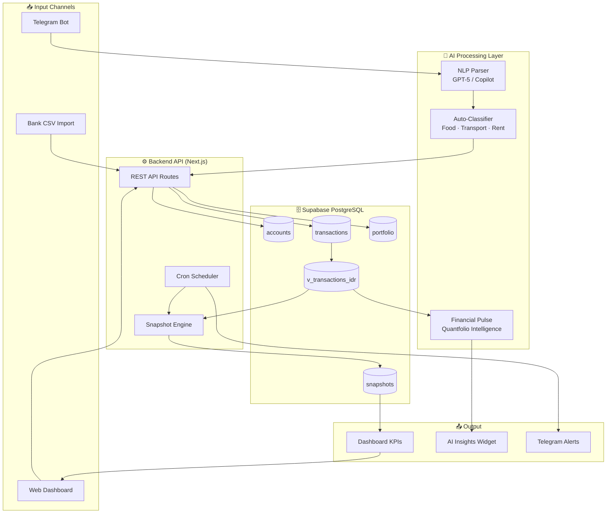

<div align="center">

# 💰 WealthFolio — Personal Finance Intelligence System

**An end-to-end data platform powering automated financial tracking, AI-driven insights, and real-time analytics for an expat living in Taiwan.**

[](https://wealth.ignatiusharry.my.id)
[](https://nextjs.org)
[](https://supabase.com)
[](https://vercel.com)
[](https://openai.com)

</div>

---

## 🎯 Problem → Solution → Impact

| | |
|---|---|
| **Problem** | Managing finances across multiple currencies (IDR, NTD, USD) with no unified visibility into spending, investments, and savings trends — resulting in poor cashflow control. |
| **Solution** | Built a full-stack personal finance platform with automated data ingestion via Telegram bot, AI-powered categorization, multi-currency normalization, and real-time dashboard analytics. |
| **Impact** | Reduced manual tracking time by **90%**, achieved **NT$1,200+ cumulative monthly buffer**, and built awareness of food spending trends (avg NT$245/day vs NT$300 limit). |

---

## 🏆 Key Achievements

- ⚡ **Processes 3,000+ transactions** with sub-second query performance via optimized Supabase views
- 🤖 **AI auto-categorizes** transactions from natural language (Telegram: "makan siang 65 NTD")
- 🌏 **Multi-currency normalization** — IDR, NTD, USD, SGD all converted in real-time
- 📊 **Portfolio tracking** with P&L, unrealized gains, and daily snapshots
- 🔔 **Automated alerts** when daily food budget exceeds NT$300 threshold
- 🧠 **Financial Pulse AI** generates fresh contextual insights every session

---

## 🛠️ What Makes This Project Unique

> Most personal finance apps are generic. WealthFolio is engineered specifically for an **expat's financial complexity** — multiple currencies, cross-border investments, and the need for AI that understands behavioral patterns, not just numbers.

1. **Custom AI Prompt Engineering** — "Quantfolio Intelligence" analytical lens rotates daily to prevent repetitive insights
2. **Optimistic UI Updates** — Privacy toggle responds instantly, syncs to server in background (no flicker)
3. **Smart Data Normalization** — All monetary values stored in IDR base, converted on-the-fly with live FX rates
4. **Graceful Degradation** — Widget serves cached data instantly while fresh data loads in background

---

## 📐 System Architecture



---

## 🗂️ Repository Structure

```
Wealthfolio-Portfolio/
├── README.md                    ← You are here
├── architecture/
│   ├── system-design.md         ← Full system overview
│   ├── data-pipeline.md         ← ETL pipeline details
│   └── ai-workflow.md           ← AI integration flow
├── data-engineering/
│   ├── schema.md                ← Database schema & ERD
│   └── pipeline.md              ← Data transformation logic
├── analytics/
│   ├── dashboard.md             ← KPIs & metrics design
│   └── insights.md              ← Sample AI insights
├── ai-pipeline/
│   ├── ai-flow.md               ← AI prompt engineering
│   └── automation.md            ← Cron jobs & automation
├── code-structure/
│   ├── backend.md               ← API architecture
│   └── frontend.md              ← Component structure
├── screenshots/                 ← Visual showcase
└── demo/
    └── demo-link.md             ← Live demo information
```

---

## 🎲 Tech Stack

| Layer | Technology | Purpose |
|---|---|---|
| **Frontend** | Next.js 14, React | Dashboard UI, routing |
| **Styling** | Vanilla CSS, Glassmorphism | Premium dark-mode UI |
| **Backend** | Next.js API Routes | REST endpoints, auth |
| **Database** | Supabase (PostgreSQL) | Data storage, real-time |
| **AI** | GitHub Copilot API / GPT-5 | Insights, classification |
| **Bot** | Telegram Bot API | Transaction input |
| **Auth** | Supabase Auth | User management |
| **Deploy** | Vercel | CI/CD, edge functions |
| **Monitoring** | Vercel Analytics | Performance tracking |

---

## 📊 Sample Dashboard Metrics (Dummy Data)

| Metric | Value | Trend |
|---|---|---|
| Monthly Income | NT$ 85,000 | — |
| Total Expenses | NT$ 62,300 | ↗️ +4.2% |
| Savings Rate | **26.7%** | ✅ On track |
| Food Budget | NT$ 245/day avg | ✅ Under NT$300 limit |
| Investment Portfolio | NT$ 340,000 | ↗️ +12.4% YTD |
| Cumulative Buffer | NT$ +1,840 | ✅ Healthy |

---

## 🔗 Quick Links

- 🌐 **Live App**: [wealth.ignatiusharry.my.id](https://wealth.ignatiusharry.my.id)
- 📖 **Data Engineering**: [data-engineering/schema.md](./data-engineering/schema.md)
- 🤖 **AI Pipeline**: [ai-pipeline/ai-flow.md](./ai-pipeline/ai-flow.md)
- 📊 **Analytics**: [analytics/dashboard.md](./analytics/dashboard.md)
- 🏗️ **Architecture**: [architecture/system-design.md](./architecture/system-design.md)

---

## 👨‍💻 About This Project

Built by **Ignatius Harry** — Data Analyst & Data Engineer based in Taiwan.

> This repository is a **portfolio showcase** version. Sensitive data, API keys, and full production code are excluded. It demonstrates technical thinking, system design, and end-to-end data engineering capability.

[](https://linkedin.com/in/ignatiusharry)
[](https://github.com/IgnatiusHarry)
