# 🤖 AI Pipeline — WealthFolio

> ⚠️ **All examples and outputs shown use fictional dummy data for portfolio demonstration only.**

## Overview

WealthFolio uses a **multi-stage AI pipeline** for two core functions:
1. **Transaction Parsing** — Convert natural language input into structured data
2. **Insight Generation** — Produce contextual, non-repetitive financial analysis

---

## Stage 1: Transaction Parsing (Bot → Database)

### Input → Output Flow

```
User (Discord): "makan siang di food court 85 NT"
         ↓
NLP Parser (GPT-4o-mini)
         ↓
Structured Output:
{
  "amount": 85,
  "currency": "NTD",
  "category": "Food",
  "description": "Makan siang di food court",
  "date": "2024-04-22",
  "type": "OUTFLOW",
  "confidence": 0.97
}
         ↓
Validation Layer (duplicate check, range check)
         ↓
INSERT INTO transactions
         ↓
Discord reply: "✅ NT$85 Food saved! Budget: 28% used today"
```

### Prompt Template (Production-Ready)

```javascript
const SYSTEM_PROMPT = `You are a financial transaction parser for WealthFolio, a personal finance tracking system.

CONTEXT:
- User is an expat based in Taiwan
- Default currency: NTD (New Taiwan Dollar)
- Exchange rates: NTD 1 ≈ IDR 500, USD 1 ≈ NTD 32

CATEGORIES:
- Food: restaurants, groceries, coffee, snacks
- Transport: MRT, bus, taxi, Grab, bike rental
- Rent: monthly rent, utilities, deposits
- Entertainment: Netflix, Spotify, movies, games
- Investment: stock purchases, ETF buys, crypto
- Income: salary, freelance, dividends, refunds
- Other: everything else

RULES:
1. If amount > 10000 NTD, flag for confirmation
2. Always detect currency (NTD, IDR, USD, SGD)
3. Return ONLY valid JSON, no explanation
4. Use current date if not specified

Respond with this JSON schema:
{
  "amount": number,
  "currency": "NTD" | "IDR" | "USD" | "SGD",
  "category": string,
  "description": string,
  "date": "YYYY-MM-DD",
  "type": "INFLOW" | "OUTFLOW" | "TRANSFER",
  "confidence": number (0-1)
}`;

const USER_PROMPT = `Parse this transaction: "{user_message}"`;

async function parseTransaction(userMessage) {
    const response = await openai.chat.completions.create({
        model: 'gpt-5-mini',
        messages: [
            { role: 'system', content: SYSTEM_PROMPT },
            { role: 'user', content: USER_PROMPT.replace('{user_message}', userMessage) }
        ],
        temperature: 0.1,
        max_tokens: 200,
        response_format: { type: 'json_object' }
    });
    
    return JSON.parse(response.choices[0].message.content);
}
```

### Structured Output via Function Calling

```javascript
// Define function schema for structured output
const transactionParserFunction = {
    name: 'parse_transaction',
    description: 'Parse a financial transaction message into structured data',
    parameters: {
        type: 'object',
        properties: {
            amount: { type: 'number', description: 'Transaction amount' },
            currency: { 
                type: 'string', 
                enum: ['NTD', 'IDR', 'USD', 'SGD', 'EUR'],
                description: 'Currency code' 
            },
            category: { 
                type: 'string',
                enum: ['Food', 'Transport', 'Rent', 'Entertainment', 'Investment', 'Income', 'Other'],
                description: 'Transaction category'
            },
            description: { type: 'string', description: 'Cleaned description' },
            date: { type: 'string', format: 'date', description: 'Transaction date YYYY-MM-DD' },
            type: { type: 'string', enum: ['INFLOW', 'OUTFLOW', 'TRANSFER'] },
            confidence: { type: 'number', minimum: 0, maximum: 1 }
        },
        required: ['amount', 'currency', 'category', 'type']
    }
};

// Use function calling for structured output
const response = await openai.chat.completions.create({
    model: 'gpt-5-mini',
    messages: [
        { role: 'system', content: SYSTEM_PROMPT },
        { role: 'user', content: userMessage }
    ],
    tools: [{
        type: 'function',
        function: transactionParserFunction
    }],
    tool_choice: { type: 'function', function: { name: 'parse_transaction' } }
});

// Parse the function call result
const parsed = JSON.parse(response.choices[0].message.tool_calls[0].function.arguments);
```

### Token Counting (Character-Based Estimation)

```javascript
// Rough estimation: ~4 characters per token
function estimateTokens(text) {
    return Math.ceil(text.length / 4);
}

// Example calculation for transaction parsing
const prompt = SYSTEM_PROMPT + USER_PROMPT;
const estimatedInputTokens = estimateTokens(prompt + userMessage);
const estimatedOutputTokens = estimateTokens('{"amount":85,"currency":"NTD",...}');

console.log(`Estimated tokens: ${estimatedInputTokens + estimatedOutputTokens}`);
// Output: ~150-200 tokens for transaction parsing

// Cost estimation (GPT-4o-mini pricing)
const INPUT_COST_PER_1K = 0.00015;  // $0.15 per 1M tokens
const OUTPUT_COST_PER_1K = 0.0006;  // $0.60 per 1M tokens

const estimatedCost = (estimatedInputTokens / 1000 * INPUT_COST_PER_1K) + 
                      (estimatedOutputTokens / 1000 * OUTPUT_COST_PER_1K);
console.log(`Estimated cost per transaction: $${estimatedCost.toFixed(6)}`);
```

### Input Sanitization

```javascript
// Sanitize user input before sending to AI
function sanitizeInput(input) {
    return input
        .replace(/[^\w\s\-.,;:()]/g, '')  // Remove special chars except these
        .replace(/\s+/g, ' ')              // Normalize whitespace
        .trim()
        .slice(0, 500);                    // Limit length
}

// Additional validation
function validateInput(input) {
    if (!input || input.length < 2) {
        throw new Error('Input too short');
    }
    if (input.length > 500) {
        throw new Error('Input exceeds 500 characters');
    }
    // Block potential prompt injection
    if (input.toLowerCase().includes('ignore') || 
        input.toLowerCase().includes('system:') ||
        input.toLowerCase().includes('you are')) {
        throw new Error('Invalid input detected');
    }
    return true;
}
```

---

## Stage 2: Financial Pulse — Insight Generation

### Deterministic Weekly Schedule

Instead of random lenses, use a deterministic schedule for consistent, predictable insights:

```javascript
const WEEKLY_LENSES = {
    0: 'behavioral',      // Monday: Behavioral patterns
    1: 'cfo',             // Tuesday: CFO-style analysis
    2: 'anomaly',         // Wednesday: Anomaly detection
    3: 'portfolio-doctor', // Thursday: Portfolio diagnosis
    4: 'predictive',      // Friday: Predictive insights
    5: 'consolidation',   // Saturday: Weekly consolidation
    6: 'week-plan'        // Sunday: Week ahead planning
};

function getAnalyticalLens() {
    const dayOfWeek = new Date().getDay();
    return WEEKLY_LENSES[dayOfWeek];
}

// Prompt variations based on lens
const LENS_PROMPTS = {
    behavioral: 'Focus on spending behavior patterns. Identify habits, peaks, and trends.',
    cfo: 'Think like a CFO — cold, data-driven analysis. Focus on savings rate, efficiency.',
    anomaly: 'Spot anomalies and outliers. Flag unusual transactions or sudden changes.',
    'portfolio-doctor': 'Diagnose portfolio health. Check allocation, risk, diversification.',
    predictive: 'Predict next week based on historical data. Forecast trends.',
    consolidation: 'Summarize the week. Consolidate key metrics and achievements.',
    'week-plan': 'Plan for the week ahead. Suggest budget adjustments and opportunities.'
};
```

**Context Window sent to AI (Dummy Example):**
```
USER: Alex | Date: 2024-04-22 (Tue) | Lens: CFO
FOOD: NT$145 / NT$300 (48%) — ON TRACK
BUFFER: NT$+2,340 cumulative | Extra/day: NT$78 | 8 days left
UNDER DAYS: 18 | OVER DAYS: 3
7-DAY FOOD: 22: NT$145, 21: NT$267, 20: NT$89, 19: NT$310, 18: NT$220, 17: NT$190, 16: NT$305
HOLDINGS: NVIDIA (NVDA), Apple (AAPL), Taiwan ETF (0050.TW)
ACCOUNTS: 3 linked
```

**Sample AI Response (Dummy):**
```
📊 CFO View: Your 26.7% savings rate is solid — 1.7% above target. Food spend at 48% of budget with 8 days remaining leaves NT$1,560 headroom.
✅ Efficiency: Daily average NT$245 vs NT$300 limit = 18% under. Keep this pace.
⚠️ Watch: Weekend food spend (avg NT$285) is 16% higher than weekdays — adjust accordingly.
```

### Parameters
| Parameter | Value | Reason |
|---|---|---|
| `temperature` | `0.75` | Varied, non-repetitive output |
| `max_tokens` | `300` | Concise, dashboard-width responses |
| `model` | `gpt-5-mini` | Cost-efficient, fast |

---

## Response Caching

Cache AI responses to reduce costs and improve latency:

```javascript
// Cache key: hash of user context + date (daily cache)
function getCacheKey(context, date) {
    const data = JSON.stringify({ context, date: date.toDateString() });
    return 'ai_insight_' + crypto.createHash('sha256').update(data).digest('hex').slice(0, 16);
}

// Cache TTL: 4 hours
const CACHE_TTL_SECONDS = 4 * 60 * 60;

async function getCachedInsight(context) {
    const today = new Date();
    const cacheKey = getCacheKey(context, today);
    
    // Check cache
    const cached = await redis.get(cacheKey);
    if (cached) {
        console.log('Cache hit for insight');
        return JSON.parse(cached);
    }
    
    // Generate new insight
    const insight = await generateInsight(context);
    
    // Store in cache
    await redis.setex(cacheKey, CACHE_TTL_SECONDS, JSON.stringify(insight));
    
    return insight;
}
```

---

## Error Recovery

```javascript
// 3-retry with exponential backoff: 1s, 2s, 4s
async function generateInsightWithRetry(context, maxRetries = 3) {
    const delays = [1000, 2000, 4000];
    
    for (let attempt = 0; attempt < maxRetries; attempt++) {
        try {
            return await generateInsight(context);
        } catch (error) {
            console.error(`Insight generation attempt ${attempt + 1} failed:`, error.message);
            
            if (attempt < maxRetries - 1) {
                await new Promise(resolve => setTimeout(resolve, delays[attempt]));
            }
        }
    }
    
    // Fallback: Rule-based classifier
    console.warn('Falling back to rule-based classifier');
    return generateRuleBasedInsight(context);
}

// Simple rule-based fallback
function generateRuleBasedInsight(context) {
    const { foodSpent, foodLimit, savingsRate } = context;
    const insights = [];
    
    if (foodSpent > foodLimit * 0.8) {
        insights.push({ type: 'warning', text: `Food budget ${Math.round(foodSpent/foodLimit*100)}% used` });
    }
    if (savingsRate > 25) {
        insights.push({ type: 'success', text: `Savings rate ${savingsRate}% exceeds target` });
    }
    
    return { insights, generated_by: 'rule-based-fallback' };
}
```

---

## Automation: Cron Jobs

```mermaid
gantt
    title Automated Jobs Schedule
    dateFormat HH:mm
    axisFormat %H:%M

    section Hourly
    FX Rate Refresh     :00:00, 30s
    RT Data Check       :00:15, 30s

    section Daily (06:00 WIB)
    Portfolio Snapshot  :06:00, 10s
    Daily Summary Bot   :06:30, 10s

    section Weekly (Mon 07:00)
    Spending Trend Report   :07:00, 15s
    Budget Reset Check      :08:00, 10s

    section Monthly (1st, 08:00)
    P&L Report          :08:00, 20s
    Category Analysis   :09:00, 15s
    Savings Rate Calc   :09:15, 10s
```



### Job Details

| Job | Trigger | Action | Duration |
|---|---|---|---|
| `fx-rate-refresh` | Hourly | Fetch latest FX rates from API | ~5s |
| `portfolio-snapshot` | Daily 06:00 | Calculate portfolio value, store snapshot | ~10s |
| `snapshot-backfill` | On deploy | Fill missing historical snapshots (30 days) | ~30s |
| `daily-summary` | Daily 06:30 | Discord message with yesterday's summary | ~10s |
| `weekly-trend` | Monday 07:00 | 7-day spending vs previous 7 days comparison | ~15s |
| `monthly-pnl` | 1st of month | Full P&L, savings rate, category breakdown | ~20s |

### Sample Daily Summary (Dummy Discord Message)
```
📊 WealthFolio Daily — April 22, 2024

💰 Yesterday's Spend: NT$312 (+4% vs 7-day avg)
🍱 Food: NT$267 / NT$300 ✅ Under budget
🚇 Transport: NT$28
🎮 Entertainment: NT$17

📈 Portfolio: NT$340,000 (+NT$2,400 today)
💼 Buffer Status: NT$+2,340 ahead for April

Tip: Weekend food spend averages NT$285—plan ahead!
```
