# 🤖 AI Pipeline — WealthFolio

> ⚠️ **All examples and outputs shown use fictional dummy data for portfolio demonstration only.**

## Overview

WealthFolio uses a **multi-stage AI pipeline** for two core functions:
1. **Transaction Parsing** — Convert natural language input into structured data
2. **Insight Generation** — Produce contextual, non-repetitive financial analysis

---

## Stage 1: Transaction Parsing (Bot → Database)

### Input → Output Flow

```
User (Telegram): "makan siang di food court 85 NT"
         ↓
NLP Parser (GPT-5)
         ↓
Structured Output:
{
  "amount": 85,
  "currency": "NTD",
  "category": "Food",
  "description": "Makan siang di food court",
  "date": "2024-04-22",
  "type": "OUTFLOW",
  "confidence": 0.97
}
         ↓
Validation Layer (duplicate check, range check)
         ↓
INSERT INTO transactions
         ↓
Telegram reply: "✅ NT$85 Food saved! Budget: 28% used today"
```

### Prompt Template (Simplified)
```
You are a financial transaction parser.
Extract structured data from: "{user_message}"

Rules:
- Default currency: NTD (Taiwan context)
- If amount > 10000 NTD, flag for confirmation
- Categories: Food, Transport, Rent, Entertainment, Investment, Income, Other
- Return valid JSON only
```

---

## Stage 2: Financial Pulse — Insight Generation

### Prompt Engineering Strategy

**Key Design Principle:** Rotate "analytical lens" randomly to prevent repetitive insights.

```javascript
const ANALYTICAL_LENSES = [
  'Focus on behavioral patterns',
  'Think like a CFO — cold, data-driven',
  'Spot anomalies and outliers',
  'Be a portfolio doctor — diagnose trends',
  'Predict next week based on this week',
  'Identify hidden risks before they surface',
];

const lens = ANALYTICAL_LENSES[Math.floor(Math.random() * ANALYTICAL_LENSES.length)];
```

**Context Window sent to AI (Dummy Example):**
```
USER: Alex | Date: 2024-04-22 (Tue)
FOOD: NT$145 / NT$300 (48%) — ON TRACK
BUFFER: NT$+2,340 cumulative | Extra/day: NT$78 | 8 days left
UNDER DAYS: 18 | OVER DAYS: 3
7-DAY FOOD: 22: NT$145, 21: NT$267, 20: NT$89, 19: NT$310, 18: NT$220, 17: NT$190, 16: NT$305
HOLDINGS: NVIDIA (NVDA), Apple (AAPL), Taiwan ETF (0050.TW)
ACCOUNTS: 3 linked
```

**Sample AI Response (Dummy):**
```
📉 Food: You overspent 3 days this week — Fri/Sun pattern suggests weekend meals need a NT$50 cap.
✅ Buffer: NT$+2,340 cushion is healthy; you can afford NT$78 extra/day for the remaining 8 days.
💡 Portfolio: NVDA up 18% YTD — consider partial profit-taking to lock in gains before Q2 earnings.
```

### Parameters
| Parameter | Value | Reason |
|---|---|---|
| `temperature` | `0.75` | Varied, non-repetitive output |
| `max_tokens` | `300` | Concise, dashboard-width responses |
| `model` | `gpt-5-mini` (Copilot) | Cost-efficient, fast |

---

## Automation: Cron Jobs

```mermaid
gantt
    title Automated Jobs Schedule
    dateFormat HH:mm
    axisFormat %H:%M

    section Hourly
    FX Rate Refresh     :00:00, 1h
    RT Data Check       :00:15, 1h

    section Daily (06:00 WIB)
    Portfolio Snapshot  :06:00, 30m
    Daily Summary Bot   :06:30, 15m

    section Weekly (Mon 07:00)
    Spending Trend Report   :07:00, 1h
    Budget Reset Check      :08:00, 30m

    section Monthly (1st, 08:00)
    P&L Report          :08:00, 1h
    Category Analysis   :09:00, 45m
    Savings Rate Calc   :09:45, 15m
```



### Job Details

| Job | Trigger | Action |
|---|---|---|
| `portfolio-snapshot` | Daily 06:00 | Calculate portfolio value, store snapshot |
| `snapshot-backfill` | On deploy | Fill missing historical snapshots (30 days) |
| `daily-summary` | Daily 06:30 | Telegram message with yesterday's summary |
| `weekly-trend` | Monday 07:00 | 7-day spending vs previous 7 days comparison |
| `monthly-pnl` | 1st of month | Full P&L, savings rate, category breakdown |

### Sample Daily Summary (Dummy Telegram Message)
```
📊 WealthFolio Daily — April 22, 2024

💰 Yesterday's Spend: NT$312 (+4% vs 7-day avg)
🍱 Food: NT$267 / NT$300 ✅ Under budget
🚇 Transport: NT$28
🎮 Entertainment: NT$17

📈 Portfolio: NT$340,000 (+NT$2,400 today)
💼 Buffer Status: NT$+2,340 ahead for April

Tip: Weekend food spend averages NT$285—plan ahead!
```
