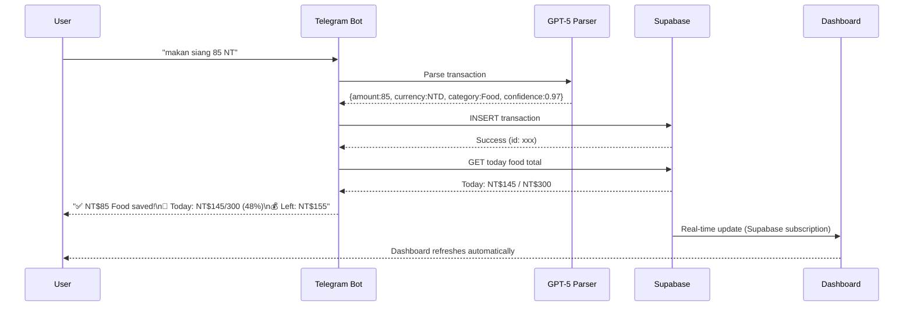

# 🤖 Automation & Cron Jobs — WealthFolio

> ⚠️ **All sample outputs and data shown are fictional dummy data for portfolio demonstration only.**

## Automation Philosophy

WealthFolio operates on a **"set and forget"** model — once configured, all tracking, summarization, and alerts run automatically without user intervention.

---

## Cron Job Registry

```javascript
// Pseudocode — automation schedule
const JOBS = [
  {
    name: 'portfolio-snapshot',
    schedule: '0 6 * * *',       // Daily at 06:00 WIB
    description: 'Calculate today portfolio value and store snapshot',
    endpoint: '/api/portfolio-snapshot',
    method: 'POST',
    retries: 3
  },
  {
    name: 'snapshot-backfill',
    schedule: 'on-deploy',        // Triggered on each deployment
    description: 'Fill any missing snapshots in the last 30 days',
    endpoint: '/api/portfolio-snapshot-backfill',
    method: 'POST',
    body: { days: 30 }
  },
  {
    name: 'daily-telegram-summary',
    schedule: '30 6 * * *',      // Daily at 06:30 WIB
    description: 'Send yesterday summary + today budget via Telegram',
    type: 'bot-message'
  },
  {
    name: 'weekly-trend-report',
    schedule: '0 7 * * 1',       // Every Monday 07:00
    description: 'Compare this week vs last week across all categories',
    type: 'bot-message'
  },
  {
    name: 'monthly-pnl',
    schedule: '0 8 1 * *',       // 1st of month, 08:00
    description: 'Full P&L, savings rate, category breakdown for last month',
    type: 'bot-message'
  }
];
```

---

## Sample Automated Outputs (Dummy Data)

### Daily Summary (Telegram)
```
📊 WealthFolio · April 22, 2024

💰 Yesterday: NT$312 spent (-4.2% vs 7-day avg NT$326)
🍱 Food: NT$267 / NT$300 ✅
🚇 Transport: NT$28
🎮 Entertainment: NT$17

📈 Portfolio: NT$340,000 (+NT$2,400 vs yesterday)
💼 Monthly Buffer: NT$+1,840 ✅ (18 under / 3 over days)

💡 Tip: Your Friday food spend is NT$82 above daily avg — plan ahead!
```

### Weekly Trend Report (Dummy)
```
📅 Weekly Report · Apr 15–21, 2024

SPENDING vs Previous Week:
🍱 Food:         NT$1,847 → NT$1,634  ↘️ -11.5% Better!
🚇 Transport:    NT$196  → NT$224     ↗️ +14.3% Watch out
🎮 Entertainment: NT$390 → NT$480    ↗️ +23.1% ⚠️ High

💰 Total:        NT$5,120 → NT$4,890  ↘️ -4.5% ✅
📈 Portfolio:    NT$330,000 → NT$340,000  ↗️ +3.0%

🏆 Best day: Apr 18 — NT$89 only (67% under budget!)
⚠️ Worst day: Apr 19 — NT$318 (6% over budget)
```

### Monthly P&L Report (Dummy)
```
📊 Monthly P&L · March 2024

INCOME:          NT$ 85,000
EXPENSES:        NT$ 64,800
NET SAVINGS:     NT$ 20,200
SAVINGS RATE:    23.8% (target: 25%) ⚠️ Slightly below

TOP CATEGORIES:
1. Rent       NT$ 17,400  (26.8%)
2. Food       NT$  6,240  (9.6%)  ↗️ +8% vs Feb
3. Investment NT$ 12,000  (18.5%)
4. Transport  NT$  2,640  (4.1%)

PORTFOLIO SNAPSHOT:
Value:  NT$ 330,000
Cost:   NT$ 290,000
P&L:    NT$ +40,000 (+13.8%) ✅
```

---

## Bot Interaction Flow (Telegram)


