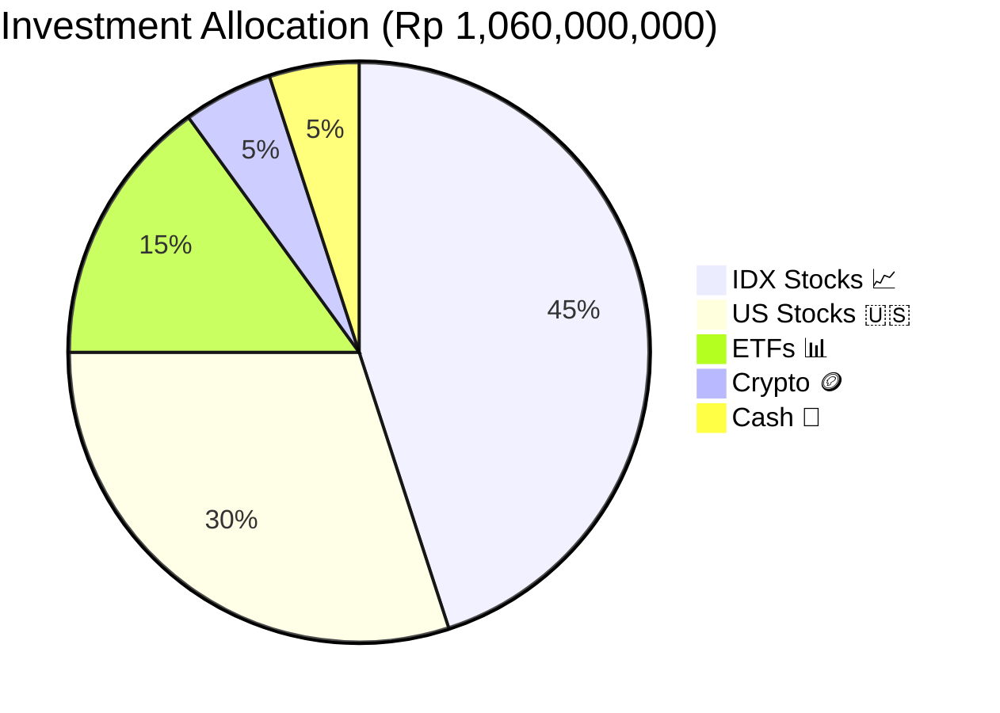

# 📊 Analytics Dashboard — WealthFolio

> ⚠️ **All metrics, charts, and examples use fictional dummy data. Not real financial data.**

## Dashboard KPI Design

> This analytics document is synced to the latest WealthFolio page modules: Dashboard, Cashflow, Portfolio, Health, Trading, Fees, Income, Goals, Wealth Growth, Insights, and Assistant.

The dashboard is designed around 3 tiers of financial awareness:

```
Tier 1 (Immediate):  Today's spending vs budget
Tier 2 (Monthly):    Cashflow, savings rate, buffer
Tier 3 (Strategic):  Portfolio P&L, investment tracking
```

---

## Key Metrics

### Dummy Scenario: Portfolio in Indonesia, April 2026

| KPI | Value (Dummy) | Period | Status |
|---|---|---|---|
| Net Worth | Rp 1,245,000,000 | Today | ↗️ +8.2% this month |
| Total Cash | Rp 185,000,000 | Today | — |
| Investment Value | Rp 1,060,000,000 | Today | ↗️ +12.4% YTD |
| Total Invested | Rp 890,000,000 | Today | — |
| Unrealized P&L | Rp +170,000,000 | Today | ✅ +19.1% |
| Savings Rate | **26.7%** | April 2026 | ✅ Above 25% target |

---

## Portfolio Allocation (Dummy Data)



---

## Holdings Performance (Dummy — Last 5 Positions)

| Symbol | Type | Qty | Avg Price | Current | P&L | P&L % |
|---|---|---|---|---|---|---|
| BBCA.JK | IDX Stock | 500 | Rp 8,200 | Rp 9,250 | +Rp 525,000 | +12.8% ✅ |
| AAPL | US Stock | 10 | $145 | $178.50 | +$335 | +23.1% ✅ |
| BBRX.JK | IDX Stock | 1000 | Rp 4,100 | Rp 3,850 | -Rp 250,000 | -6.1% ⚠️ |
| IHSG ETF | ETF | 200 | Rp 1,050 | Rp 1,180 | +Rp 26,000 | +12.4% ✅ |
| NVDA | US Stock | 5 | $420 | $890 | +$2,350 | +111.9% ✅ |

---

## Sample AI-Generated Insights (Dummy)

These are **example outputs** from the WealthFolio AI system:

> 📊 **Portfolio Health Score: 7.5/10** — Strong performance with moderate concentration risk in tech stocks.

> 📉 **Risk Alert:** NVDA represents 35% of portfolio — consider rebalancing to lower single-stock concentration.

> 💡 **Opportunity:** Shift 10% from NVDA to IHSG ETF for diversification while locking in gains.

> 💰 **Cashflow Tip:** Food variance is +12% this month — review weekend spending patterns.

---

## Cashflow Waterfall (Dummy — April 2026)

```
Income:          Rp +85,000,000
  └─ Salary      Rp +85,000,000

Expenses:        Rp -62,300,000
  ├─ Rent        Rp -17,400,000
  ├─ Food        Rp -13,706,000
  ├─ Transport   Rp -5,240,000
  ├─ Entertainment Rp -7,860,000
  ├─ Investment  Rp -12,500,000
  └─ Other       Rp -5,594,000

Net Savings:     Rp +22,700,000
Savings Rate:    26.7% ✅
```

---

## Analytics Methodology

### Currency Normalization
All transactions stored with `amount_idr` column for unified aggregation. FX resolution uses:

```javascript
// resolveFxRate() chain
async function resolveFxRate(db, date, currency) {
  if (currency === 'IDR') return 1;
  
  // 1. Try fx_history (historical rates)
  const historical = await db.from('fx_history')
    .select('rate')
    .eq('currency', currency)
    .eq('date', date)
    .single();
  if (historical.data) return historical.data.rate;
  
  // 2. Fallback to fx_rates (latest rates)
  const latest = await db.from('fx_rates')
    .select('rate')
    .eq('from_ccy', currency)
    .single();
  if (latest.data) return latest.data.rate;
  
  // 3. Fallback to 1.0 with warning
  return 1.0;
}
```

### Category Classification Logic

Multi-signal classification with AI fallback:

```javascript
// Simplified classification
function classifyTransaction(description, amount) {
  const desc = description.toUpperCase();
  
  // Signal 1: Keyword matching
  if (desc.includes('MAKAN') || desc.includes('FOOD') || desc.includes('RESTAURANT'))
    return 'Food';
  if (desc.includes('MRT') || desc.includes('BUS') || desc.includes('GRAB'))
    return 'Transport';
  if (desc.includes('RENT') || desc.includes('SEWA') || desc.includes('KOS'))
    return 'Rent';
  
  // Signal 2: Amount pattern
  if (amount > 5000000 && !desc.includes('SALARY')) 
    return 'Large Expense';
    
  // Signal 3: AI fallback
  return aiClassify(description);
}
```

---

## Real-Time Data Sources

| Data | Source Table | Refresh |
|---|---|---|
| Account balances | `accounts` | Real-time |
| Portfolio holdings | `portfolio` + `investment_assets` | Real-time |
| Market prices | `market_data` | Daily (15:30 UTC via OpenClaw) |
| FX rates | `fx_rates` | Daily |
| Daily snapshot | `portfolio_snapshot` | Daily (15:00 UTC) |
| AI insights | `ai_insights` | Daily (01:00 UTC) |
