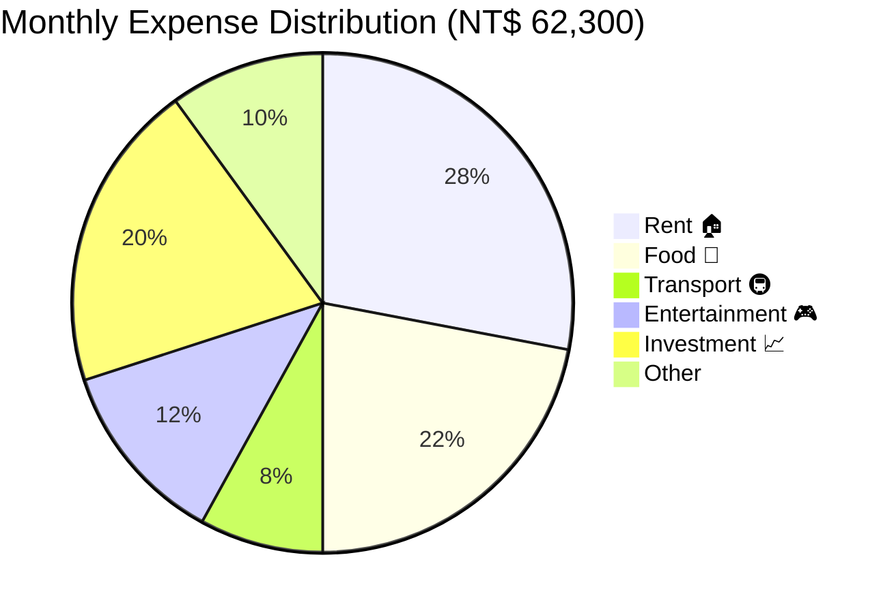

# 📊 Analytics Dashboard — WealthFolio

> ⚠️ **All metrics, charts, and examples use fictional dummy data. Not real financial data.**

## Dashboard KPI Design

The dashboard is designed around 3 tiers of financial awareness:

```
Tier 1 (Immediate):  Today's food spend vs budget
Tier 2 (Monthly):    Cashflow, savings rate, buffer
Tier 3 (Strategic):  Portfolio P&L, investment tracking
```

---

## Key Metrics

### Dummy Scenario: Expat in Taiwan, April 2024

| KPI | Value (Dummy) | Period | Status |
|---|---|---|---|
| Monthly Income | NT$ 85,000 | April 2024 | — |
| Total Expenses | NT$ 62,300 | April 2024 | ↗️ +4.2% vs March |
| Savings Rate | **26.7%** | April 2024 | ✅ Above 25% target |
| Food Spend (avg/day) | NT$ 245 | This month | ✅ Under NT$300 limit |
| Portfolio Value | NT$ 340,000 | Today | ↗️ +12.4% YTD |
| Cumulative Buffer | NT$ +1,840 | Month-to-date | ✅ 18 under / 3 over |
| Net Worth Change | +NT$ 22,700 | April 2024 | ↗️ New high |

---

## Spending Breakdown (Dummy Data)



---

## Food Budget Trend (Dummy — Last 7 Days)

| Date | Spend (NT$) | vs Limit | Status |
|---|---|---|---|
| Apr 22 (Today) | 145 | -155 | ✅ On Track |
| Apr 21 | 267 | -33 | ✅ On Track |
| Apr 20 | 89 | -211 | ✅ Under |
| Apr 19 | **318** | **+18** | ⚠️ Over Budget |
| Apr 18 | 220 | -80 | ✅ On Track |
| Apr 17 | 190 | -110 | ✅ On Track |
| Apr 16 | **305** | **+5** | ⚠️ Over Budget |

**7-Day Average:** NT$219/day — **27% under budget** ✅

---

## Sample AI-Generated Insights (Dummy)

These are **example outputs** from the Financial Pulse system:

> 📉 **Food pattern alert:** You overspend on Saturdays by avg NT$67 vs weekdays — consider meal-prepping on Fridays.

> ✅ **Buffer healthy:** NT$+1,840 ahead of target with 8 days left — that's NT$230 buffer room per remaining day.

> 💡 **Portfolio tip:** With 3 positions up >10% this month, consider rebalancing 5% into cash buffer for Q2 volatility protection.

---

## Cashflow Waterfall (Dummy — April 2024)

```
Income:          NT$ +85,000
  └─ Salary      NT$ +85,000

Expenses:        NT$ -62,300
  ├─ Rent        NT$ -17,400
  ├─ Food        NT$ -5,390
  ├─ Transport   NT$ -2,240
  ├─ Entertainment NT$ -3,120
  ├─ Investment  NT$ -12,500
  └─ Other       NT$ -2,150       (wait, rest is remaining)

Net Savings:     NT$ +22,700
Savings Rate:    26.7% ✅
```

---

## Analytics Methodology

### Currency Normalization
All transactions stored with `amount_idr` column for unified aggregation:
```
NT$1 = IDR 500 (approximate, rate refreshed daily)
USD$1 = IDR 16,200
SGD$1 = IDR 12,000
```

### Category Classification Logic
```javascript
// Simplified auto-classification rules
const classifyTransaction = (description, amount, currency) => {
  const desc = description.toUpperCase();
  if (desc.includes('MAKAN') || desc.includes('FOOD') || desc.includes('RESTAURANT'))
    return 'Food';
  if (desc.includes('MRT') || desc.includes('BUS') || desc.includes('GRAB'))
    return 'Transport';
  if (desc.includes('RENT') || desc.includes('SEWA') || desc.includes('KOS'))
    return 'Rent';
  // ... AI-powered fallback for unrecognized descriptions
  return await aiClassify(description);
};
```
