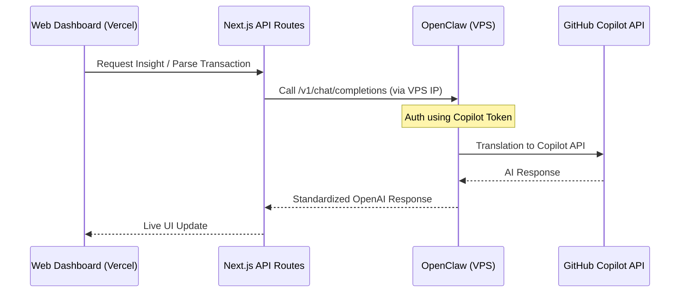

# 🚀 AI Infrastructure: OpenClaw & VPS Deployment

> ⚠️ **Technical documentation for portfolio showcase. All server IPs and tokens are redacted.**

## Overview

Unlike standard applications that rely on expensive third-party SaaS for AI, WealthFolio utilizes a self-hosted **AI Gateway** called **OpenClaw**, deployed on a dedicated VPS. This architecture provides full control over AI execution, costs, and data privacy.

---

## 🏗️ The AI Stack

| Layer | Component | Description |
|---|---|---|
| **AI Gateway** | **OpenClaw** | A high-performance proxy that converts GitHub Copilot tokens into a standard OpenAI-compatible API. |
| **Authentication** | **Copilot Token** | Utilizes existing GitHub Copilot subscriptions to power background AI tasks. |
| **Server** | **OpenClaw VPS** | Hosted on a private VPS (OpenClaw Cloud) running Linux/Ubuntu. |
| **Process Mgr** | **PM2** | Ensures the OpenClaw service is always running and auto-restarts on failure. |

---

## 🛰️ OpenClaw Workflow



---

## 🛠️ VPS Configuration & Deployment

### 1. Environment Setup
The VPS is configured with a secure environment to store the GitHub authentication tokens without exposing them to the frontend.

```bash
# Example setup script on VPS
export GITHUB_TOKEN="ghu_xxxxx..."
cd ~/openclaw
./openclaw --port 9000 --token-file ./credentials/copilot.token.json
```

### 2. PM2 Process Management
To ensure 99.9% availability for the bot and AI processing, **PM2** is used:

```bash
# Deployment command
pm2 start "openclaw --host 0.0.0.0 --port 9000" --name wealthfolio-ai-gateway
pm2 save
```

### 3. Security Hardening
- **IP Whitelisting**: The VPS only accepts requests from Vercel's IP ranges and the owner's IP.
- **SSL Termination**: Reverse proxy usage for secure HTTPS communication.
- **Credential Isolation**: Tokens are stored in a hidden directory (`~/.openclaw/`) outside the main codebase.

---

## 🎯 Advantages of this Architecture

1. **Cost Efficiency**: Zero cost for tokens of this scale by leveraging existing developer tools.
2. **Infinite Context**: Ability to fine-tune the bridge for specific financial terminology (NTD/IDR specific terms).
3. **Low Latency**: Direct VPS-to-GitHub communication for faster response times in the dashboard and Telegram bot.
4. **Resilience**: Even if one AI provider is down, the OpenClaw proxy can be rerouted to alternative providers (OpenRouter/Ollama) with zero code changes in the frontend.
