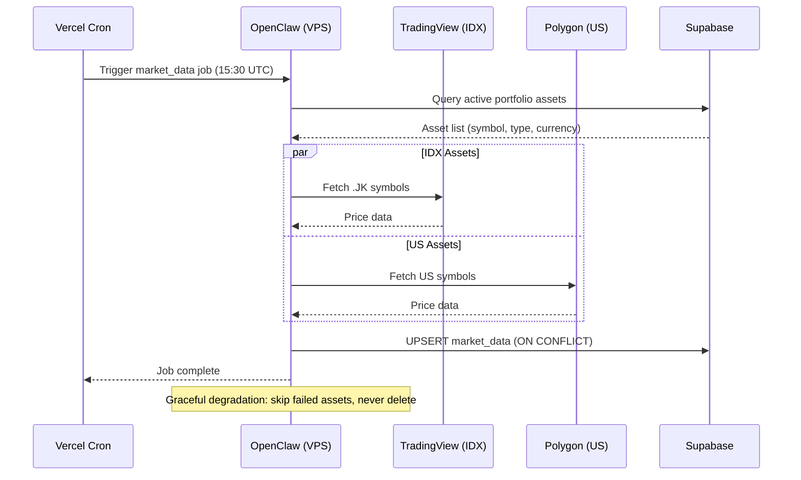
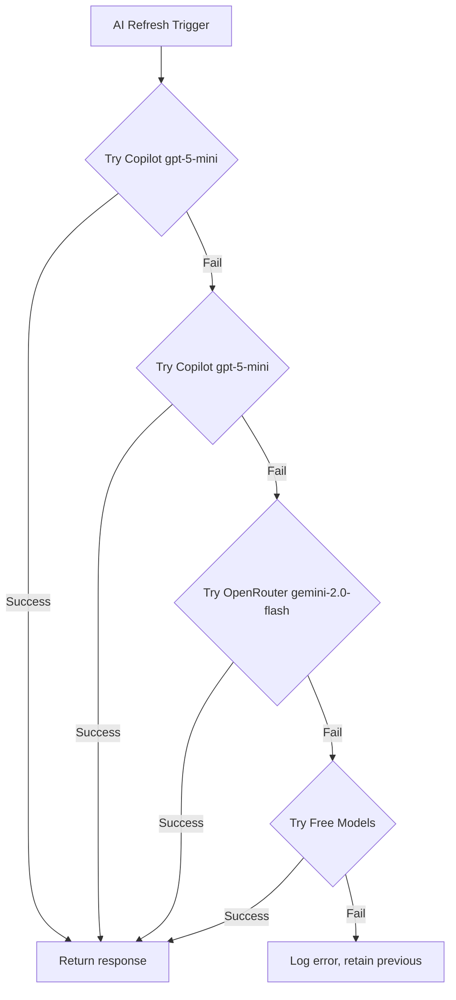

# 🚀 AI Orchestration & Market Data Ingestion

> ⚠️ **Technical documentation for portfolio showcase. Server IPs and tokens are redacted.**

## Overview

WealthFolio uses **OpenClaw** as an AI orchestration platform deployed on a dedicated VPS. OpenClaw manages:
1. **Market data ingestion** — Daily price updates from TradingView and Polygon
2. **AI provider routing** — Fallback chain for insight generation
3. **FX rate refresh** — Currency rate updates

---

## Architecture

| Layer | Component | Description |
|---|---|---|
| **Orchestrator** | **OpenClaw** | Manages scheduled jobs, API routing, and provider fallback |
| **VPS** | **Linux Server** | Hosts OpenClaw agent with PM2 process management |
| **Market Data** | **TradingView / Polygon** | Dual-source price feeds |
| **AI Providers** | **Copilot / OpenRouter** | Primary and fallback LLM providers |

---

## OpenClaw Workflow



---

## Market Data Job Specification

### Job: `market_data_daily_refresh`

**Schedule:** Daily at 15:30 UTC (22:30 WIB / 13:30 SGT)

**Input Query:**
```sql
SELECT DISTINCT
  ia.id AS asset_id,
  ia.symbol,
  ia.asset_name,
  ia.asset_type,
  ia.currency,
  CASE 
    WHEN ia.symbol LIKE '%.JK' THEN 'TradingView'
    ELSE 'Polygon'
  END AS source_preference
FROM portfolio p
INNER JOIN investment_assets ia ON p.asset_id = ia.id
WHERE ia.asset_type IN ('stock', 'etf', 'us_stock')
  AND ia.currency IN ('IDR', 'USD', 'SGD', 'NTD')
GROUP BY ia.id, ia.symbol, ia.asset_name, ia.asset_type, ia.currency
ORDER BY ia.symbol;
```

### Source Routing

| Condition | Source | Example |
|---|---|---|
| Symbol ends with `.JK` | TradingView | `BBCA.JK`, `BULL.JK` |
| Other symbols | Polygon | `AAPL`, `SPY`, `QQQ` |

### UPSERT Logic

```sql
INSERT INTO market_data (asset_id, price, price_change, price_change_pct, currency, source, last_updated_at)
VALUES (?, ?, ?, ?, ?, ?, NOW())
ON CONFLICT (asset_id) DO UPDATE SET
  price = EXCLUDED.price,
  price_change = EXCLUDED.price_change,
  price_change_pct = EXCLUDED.price_change_pct,
  source = EXCLUDED.source,
  last_updated_at = NOW();
```

### Error Handling

| Scenario | Action |
|---|---|
| TradingView API down | Try Polygon, else skip asset |
| Polygon API down | Try fallback source, else skip |
| Rate limit hit | Retry with backoff |
| Malformed response | Skip asset, log error |
| Network timeout | Retry once, then skip |

---

## AI Provider Routing

OpenClaw manages the AI provider chain for insight generation:



---

## VPS Configuration

### Environment Variables

```bash
# Required for market data
POLYGON_API_KEY=<polygon-api-key>
SUPABASE_SERVICE_ROLE_KEY=<supabase-key>
SUPABASE_URL=<supabase-url>

# Required for AI (if using Copilot)
GITHUB_COPILOT_OAUTH_TOKEN=<oauth-token>
GITHUB_COPILOT_TOKEN=<direct-token>

# Optional for OpenRouter fallback
OPENROUTER_API_KEY=<openrouter-key>
OPENROUTER_FALLBACK_KEY=<fallback-key>
```

### Process Management (PM2)

```bash
# Start OpenClaw agent
pm2 start "openclaw --host 0.0.0.0 --port 9000" --name wealthfolio-agent

# Auto-restart on failure
pm2 start ecosystem.config.js

# View logs
pm2 logs wealthfolio-agent

# Ensure startup on reboot
pm2 save
pm2 startup
```

### Security Hardening

- **UFW Firewall:** Only allow ports 22, 80, 443
- **HTTPS Only:** Reverse proxy with SSL termination
- **Token Isolation:** Environment variables, not in code
- **IP Whitelisting:** Restrict DB access to VPS IP

---

## Monitoring & Logging

### Job Logs

```
[market_data] Job started. Processing 12 assets.
[market_data] BBCA.JK: 9250 IDR from TradingView
[market_data] AAPL: 178.50 USD from Polygon
[market_data] BBRX.JK: FAILED - 404 Not Found
[market_data] Job complete. 11 succeeded, 1 failed. Elapsed: 4523ms
```

### Freshness SLA

| Table | SLA | Query |
|---|---|---|
| `market_data` | Within 24 hours | `SELECT MIN(last_updated_at) FROM market_data` |
| `portfolio_snapshot` | Today or yesterday | `SELECT MAX(date) FROM portfolio_snapshot` |
| `ai_insights` | Within 48 hours | `SELECT generated_at FROM ai_insights WHERE id=1` |

### Alert Conditions

- Job fails to complete within 5 minutes
- <80% asset success rate
- market_data table empty or row count < expected
- `last_updated_at` > 24 hours old

---

## Advantages of This Architecture

1. **Full Control:** Custom job scheduling beyond Vercel limits
2. **Dual-Source Routing:** Optimized price feeds per market
3. **Graceful Degradation:** Never lose data on API failures
4. **Provider Fallback:** Multiple AI providers ensure reliability
5. **Freshness Tracking:** SLA monitoring for data quality
