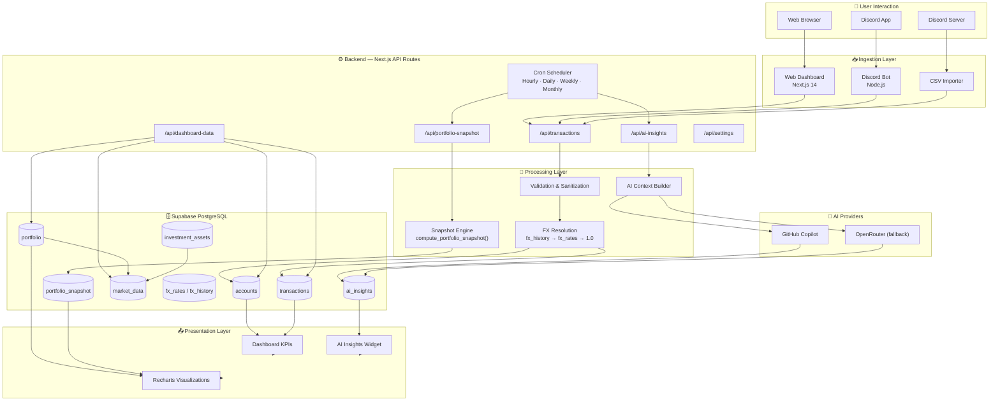

# 🏗️ System Architecture — WealthFolio

> ⚠️ **Note:** All data, metrics, and examples in this document use **fictional dummy data** for portfolio demonstration only.

## Overview

WealthFolio is designed as a **three-layer data platform**:

1. **Ingestion Layer** — Multiple input channels (Discord, web, CSV)
2. **Processing Layer** — AI parsing, FX normalization, daily snapshots
3. **Presentation Layer** — Dashboard, AI insights, alerts

---

## Full System Design

---

## Data Flow Summary

### Transaction Flow
1. User submits transaction (Discord/web/CSV)
2. Server validates input (`safeTable`, `safeOrder`)
3. FX resolution: `fx_history` (historical) → `fx_rates` (latest) → 1.0
4. Server computes `amount_idr = amount * fx_rate`
5. Insert to `transactions` table

### Portfolio Valuation Flow
1. Cron triggers `/api/cron/snapshot-daily` at 15:00 UTC
2. SQL function `compute_portfolio_snapshot()` aggregates:
   - Investment value from `portfolio` + `market_data`
   - Cash value from `accounts` + `fx_rates`
3. Upsert to `portfolio_snapshot` and `wealth_ledger_daily`

### Market Data Flow
1. OpenClaw agent triggers at 15:30 UTC
2. Query active portfolio assets
3. Route by symbol: TradingView (.JK) or Polygon (US)
4. UPSERT to `market_data` with freshness timestamp

### AI Insight Flow
1. Cron triggers `/api/cron/ai-refresh` at 01:00 UTC
2. `getPortfolioContext()` builds context from DB
3. Provider chain: Copilot → OpenRouter → free models
4. Upsert to `ai_insights` (singleton id=1)

---

## Scalability Considerations

| Concern | Current Approach | Scale-up Path |
|---|---|---|
| **Query speed** | Supabase + limit params | Add Redis caching |
| **AI cost** | Cached insights, provider fallback | Rate-limiting + edge caching |
| **Multi-user** | Single user (personal) | Supabase RLS per user |
| **Data volume** | ~3,000 transactions | Partition by month |
| **Market data** | OpenClaw dual-source | Add more providers |

---

## Security Design

- ✅ No API keys in client-side code
- ✅ Supabase Row Level Security (RLS) enabled
- ✅ Cron endpoints validate `CRON_SECRET` header
- ✅ Privacy Mode — blur all sensitive numbers client-side
- ✅ Service role key used only in server-side API routes
- ✅ Environment variables stored securely on VPS
- ✅ UFW firewall + HTTPS only on OpenClaw VPS
