# 🏗️ System Architecture — WealthFolio (Detailed)

> ⚠️ **Note:** This portfolio documentation mirrors production architecture and feature flow, but all examples are dummy/sanitized (no private financial data, no secrets).

## 1) High-Level Architecture

WealthFolio runs as a modular full-stack system with 5 layers:

1. **Experience Layer (UI/UX)**
   - Next.js pages + React components
   - Dashboard, Cashflow, Portfolio, Goals, Income, Fees, Trading, Health, Insights, Assistant
   - Privacy Mode, Theme Toggle, Mobile Navigation

2. **Application Layer (API Routes)**
   - Transaction write/read
   - Snapshot and wealth growth endpoints
   - AI insight + assistant proxy endpoints
   - SQL diagnostics (restricted/admin)

3. **Intelligence Layer (AI + Rules)**
   - NLP parsing for natural language transaction input
   - Context building from portfolio/cashflow/snapshot data
   - Provider fallback chain (primary → fallback)

4. **Data Layer (Supabase PostgreSQL)**
   - Operational tables (`transactions`, `accounts`, `portfolio`, etc.)
   - Derived tables (`portfolio_snapshot`, `wealth_ledger_daily`, `ai_insights`)
   - FX and market price tables (`fx_rates`, `fx_history`, `market_data`)

5. **Automation Layer (Cron + OpenClaw)**
   - Scheduled AI refresh
   - Daily snapshot generation/reconciliation
   - Market data ingestion and FX refresh via OpenClaw VPS

---

## 2) Detailed Runtime Diagram

```mermaid
graph TB
    subgraph Client["🖥️ Experience Layer"]
        WEB["Web App (Next.js)"]
        MOB["Mobile Browser"]
        DISC["Discord Input"]
    end

    subgraph UI["🎨 Feature Modules"]
        D1["Dashboard"]
        D2["Cashflow"]
        D3["Portfolio"]
        D4["Health"]
        D5["Trading"]
        D6["Fees"]
        D7["Income"]
        D8["Goals"]
        D9["Insights"]
        D10["Assistant"]
    end

    subgraph API["⚙️ Application Layer (pages/api)"]
        A1["/api/transactions"]
        A2["/api/insert-transaction"]
        A3["/api/snapshots"]
        A4["/api/portfolio-snapshot"]
        A5["/api/ai-insights"]
        A6["/api/chat"]
        A7["/api/goals"]
        A8["/api/fee-summary"]
        A9["/api/trade-matches"]
        A10["/api/sql (restricted)"]
    end

    subgraph Logic["🧠 Intelligence & Domain Logic"]
        L1["Validation & Sanitization"]
        L2["FX Resolver fx_history→fx_rates→1.0"]
        L3["Snapshot Engine compute_portfolio_snapshot"]
        L4["Trade Matching Engine"]
        L5["AI Context Builder"]
        L6["Provider Router (Primary/Fallback)"]
    end

    subgraph DB["🗄️ Supabase PostgreSQL"]
        T1[(transactions)]
        T2[(accounts)]
        T3[(portfolio)]
        T4[(investment_assets)]
        T5[(investment_transactions)]
        T6[(market_data)]
        T7[(fx_rates)]
        T8[(fx_history)]
        T9[(portfolio_snapshot)]
        T10[(wealth_ledger_daily)]
        T11[(goals)]
        T12[(ai_insights)]
    end

    subgraph Auto["⏱️ Automation Layer"]
        C1["Vercel Cron"]
        C2["OpenClaw VPS Jobs"]
        C3["Market Data Refresh"]
        C4["FX Refresh"]
        C5["AI Refresh"]
        C6["Snapshot Daily/Reconcile"]
    end

    WEB --> D1
    WEB --> D2
    WEB --> D3
    WEB --> D4
    WEB --> D5
    WEB --> D6
    WEB --> D7
    WEB --> D8
    WEB --> D9
    WEB --> D10
    MOB --> WEB
    DISC --> A2

    D1 --> A3
    D2 --> A1
    D3 --> A3
    D4 --> A5
    D5 --> A9
    D6 --> A8
    D7 --> A1
    D8 --> A7
    D9 --> A5
    D10 --> A6

    A1 --> L1
    A2 --> L1
    A2 --> L2
    A3 --> L1
    A4 --> L3
    A5 --> L5
    A6 --> L5
    A6 --> L6
    A9 --> L4

    L1 --> T1
    L2 --> T7
    L2 --> T8
    L2 --> T2
    L2 --> T1
    L3 --> T3
    L3 --> T6
    L3 --> T2
    L3 --> T9
    T9 --> T10
    L4 --> T5
    L5 --> T1
    L5 --> T2
    L5 --> T3
    L5 --> T9
    L6 --> T12

    A1 --> T1
    A3 --> T9
    A5 --> T12
    A7 --> T11
    A8 --> T5
    A9 --> T5
    A10 --> DB

    C1 --> C5
    C1 --> C6
    C2 --> C3
    C2 --> C4
    C5 --> A5
    C6 --> A4
    C3 --> T6
    C4 --> T7
```

---

## 3) Core Flows (1:1 with app behavior)

### A. Transaction Ingestion Flow
1. User submits transaction (Discord/Web/Import).
2. API validates payload structure + business rules.
3. FX normalization resolves historical rate first, then latest rate fallback.
4. `amount_idr` computed server-side.
5. Transaction persisted to `transactions`.
6. Dashboard/cashflow views consume updated data.

### B. Portfolio Valuation Flow
1. Snapshot trigger runs from cron/manual endpoint.
2. `compute_portfolio_snapshot` aggregates:
   - cash accounts (with FX conversion)
   - holdings valuation (portfolio + market_data)
3. Result upserted into `portfolio_snapshot`.
4. Optional mirror written to `wealth_ledger_daily`.
5. Wealth growth and KPI cards read from snapshots.

### C. AI Insight + Assistant Flow
1. API builds context from portfolio, cashflow, and trend tables.
2. Provider router executes primary model; fallback if needed.
3. Result normalized and stored in `ai_insights`.
4. Insights page and assistant module render the latest output.

### D. Market Data & FX Automation Flow
1. OpenClaw scheduled jobs pull latest prices and FX.
2. Data is upserted (no destructive overwrite semantics).
3. Snapshot and dashboard consume fresh market/FX data.

---

## 4) Security & Reliability Design

- Server-side secret isolation for service keys and model provider keys
- Cron endpoints guarded by bearer secret
- Restricted SQL diagnostics endpoint for internal/admin use
- Graceful degradation (keep-last-good insight/snapshot)
- Retry/backoff for external dependency failures
- Privacy mode at UI layer for sensitive number masking

---

## 5) Scalability Notes

- Current architecture is optimized for personal/solo usage with rich analytics.
- Scale-up path:
  - per-user data partitioning + RLS hardening
  - caching hot endpoints (dashboard/snapshots)
  - queue-based background processing for heavy jobs
  - model usage guardrails and response caching
