# 🔄 Data Pipeline — WealthFolio

> ⚠️ **All example data is fictional dummy data for portfolio demonstration only.**

## Pipeline Overview

```
INPUT → PARSE → VALIDATE → TRANSFORM → STORE → AGGREGATE → OUTPUT
```

## Full Pipeline Diagram

```mermaid
flowchart LR
    subgraph Input["📥 Input Sources"]
        A1[Telegram Bot Message\n'makan 85 NT']
        A2[Web Form Entry]
        A3[Bank CSV Upload]
    end

    subgraph Parse["🔍 AI Parsing"]
        B1[GPT-5 NLP Parser]
        B2[Extract Fields:\namount · currency\ncategory · date]
        B3[Confidence Score\n> 0.85 required]
    end

    subgraph Validate["✅ Validation"]
        C1[Duplicate Detection\n24h window, same amount+desc]
        C2[Range Check\n> NT$50,000 → flag]
        C3[Currency Detection\nNTD · IDR · USD · SGD]
    end

    subgraph Transform["⚙️ Transformation"]
        D1[FX Normalization\nAll → IDR base]
        D2[Category Mapping\nFood · Transport · Rent...]
        D3[Date Standardization\nYYYY-MM-DD UTC]
    end

    subgraph Store["🗄️ Storage - Supabase"]
        E1[(transactions table)]
        E2[(accounts - update balance)]
    end

    subgraph Aggregate["📊 Aggregation"]
        F1[v_transactions_idr VIEW\nPre-joined, normalized]
        F2[Monthly summaries]
        F3[Portfolio snapshots]
    end

    subgraph Output["📤 Output"]
        G1[Dashboard KPIs]
        G2[AI Insights]
        G3[Telegram confirmation]
    end

    A1 & A2 & A3 --> B1
    B1 --> B2 --> B3
    B3 --> C1 --> C2 --> C3
    C3 --> D1 --> D2 --> D3
    D3 --> E1 & E2
    E1 --> F1 --> F2 & F3
    F1 & F2 & F3 --> G1 & G2 & G3
```



---

## Transformation Examples (Dummy Data)

### Multi-Currency Normalization

```javascript
// Input (raw)
{ amount: 85, currency: 'NTD', description: 'Makan siang' }

// After transformation
{
  amount: 85,
  currency: 'NTD',
  amount_idr: 42500,  // NT$1 ≈ IDR 500
  category: 'Food',
  type: 'OUTFLOW',
  date: '2024-04-22',
  source: 'telegram'
}
```

### Batch CSV Import Transformation

```javascript
// Raw CSV row:
// "22/04/2024","TRANSFER DB - MAKAN SIANG FD","-95","TWD"

// After pipeline:
{
  date: '2024-04-22',
  description: 'Makan Siang',
  category: 'Food',         // AI-classified
  type: 'OUTFLOW',
  amount: 95,
  currency: 'NTD',
  amount_idr: 47500,
  source: 'csv_import'
}
```

---

## Error Handling & Resilience

| Scenario | Handling |
|---|---|
| AI parser fails | Fallback to rule-based classifier → manual review queue |
| FX rate unavailable | Use last known rate + timestamp warning |
| Supabase connection timeout | 3-attempt retry with 1.5s exponential backoff |
| Duplicate transaction | Skip insert, return existing record ID |
| Amount out of range | Flag for user confirmation, don't auto-save |
