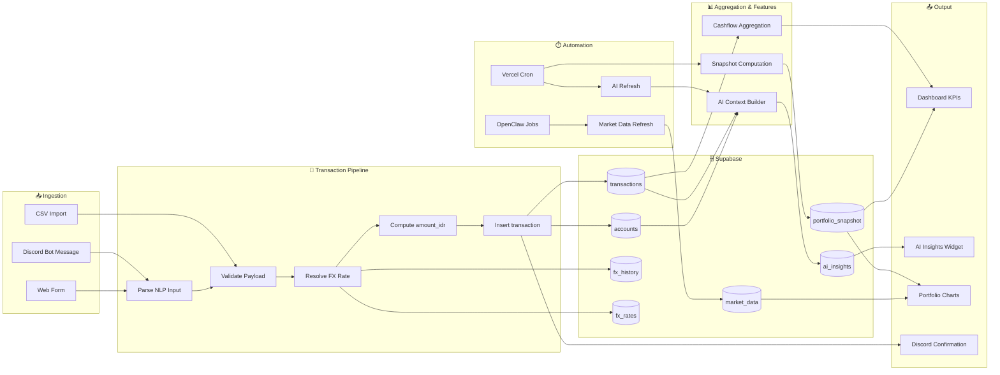

# 🔄 Data Pipeline — WealthFolio

> ⚠️ **Disclaimer:** All example data is fictional for portfolio demonstration purposes only.

## Pipeline Overview

```
INPUT → PARSE → VALIDATE → TRANSFORM → STORE → AGGREGATE → OUTPUT
```

## Full Pipeline Diagram



---

## Pipeline Stages

### 1. Transaction Ingestion

**Input:** User submits transaction (Discord, Web, CSV)

**Processing:**
- Input validation via `safeTable()` and `safeOrder()` functions
- FX normalization via `resolveFxRate()` chain
- Server-side `amount_idr` computation

**FX Resolution Chain:**
```javascript
async function resolveFxRate(db, date, currency) {
  if (currency === 'IDR') return 1;
  
  // 1. Try historical fx_history for transaction date
  const historical = await db.from('fx_history')
    .select('rate')
    .eq('currency', currency)
    .eq('date', date)
    .single();
  
  if (historical.data) return historical.data.rate;
  
  // 2. Fallback to latest fx_rates
  const latest = await db.from('fx_rates')
    .select('rate')
    .eq('from_ccy', currency)
    .single();
  
  if (latest.data) return latest.data.rate;
  
  // 3. Fallback to 1.0 with warning
  console.warn(`No FX rate found for ${currency}, using 1.0`);
  return 1.0;
}
```

**Output:** Row in `transactions` table with resolved `fx_rate` and `amount_idr`

---

### 2. Investment Transaction Processing

**Input:** Buy/sell transactions from portfolio management

**Processing:**
- Upsert to `investment_assets` if new symbol
- Insert into `investment_transactions`
- Recalculate portfolio position (quantity, avg_price, total_invested_idr)

**Dedup Logic:** `scripts/clean_duplicates.py` consolidates duplicate symbols

---

### 3. Daily Snapshot Pipeline

**Trigger:** Vercel Cron `/api/cron/snapshot-daily` at 15:00 UTC

**Processing:**
```sql
-- SQL function aggregates portfolio + accounts
SELECT * FROM compute_portfolio_snapshot(CURRENT_DATE);
```

**Logic:**
1. Sum `current_value_idr` from portfolio holdings
2. Sum `total_invested_idr` from portfolio
3. Calculate gains/losses per holding
4. Sum account balances, convert to IDR via latest `fx_rates`
5. Upsert to `portfolio_snapshot` by date
6. Mirror to `wealth_ledger_daily` for audit trail

**Reconciliation:** `/api/cron/snapshot-reconcile` at 15:45 UTC

---

### 4. Market Data Ingestion

**Trigger:** OpenClaw agent daily at 15:30 UTC

**Processing:**
- Query active portfolio assets from `investment_assets`
- Route by symbol:
  - **TradingView** for `.JK` symbols (IDX)
  - **Polygon** for US symbols
- UPSERT to `market_data` with ON CONFLICT DO UPDATE

**UPSERT Pattern:**
```sql
INSERT INTO market_data (asset_id, price, price_change, price_change_pct, currency, source, last_updated_at)
VALUES (?, ?, ?, ?, ?, ?, NOW())
ON CONFLICT (asset_id) DO UPDATE SET
  price = EXCLUDED.price,
  price_change = EXCLUDED.price_change,
  price_change_pct = EXCLUDED.price_change_pct,
  source = EXCLUDED.source,
  last_updated_at = NOW();
```

**Graceful Degradation:**
- Skip assets on API failure, never delete existing data
- Log failures with source and reason

---

### 5. AI Insight Generation

**Trigger:** Vercel Cron `/api/cron/ai-refresh` at 01:00 UTC

**Processing:**
1. `getPortfolioContext()` builds context string from:
   - Accounts (name, balance, currency)
   - Portfolio (holdings, P&L, allocation)
   - Transactions (recent income/expenses)
   - FX rates
2. Call AI provider chain (Copilot → OpenRouter → free models)
3. Upsert to `ai_insights` table (singleton id=1)

---

## Data Quality Controls

| Control | Implementation |
|---|---|
| Input validation | `safeTable()`, `safeOrder()` allowlists |
| Null checks | NOT NULL constraints on required columns |
| FX validation | Server-computed `amount_idr` vs client-supplied |
| Duplicate detection | 24h window, same amount + description |
| Freshness monitoring | `last_updated_at` SLA tracking (24h for market_data) |
| Audit trail | Dual-sink to `wealth_ledger_daily` |

---

## Error Handling

| Scenario | Handling |
|---|---|
| AI parser fails | Fallback to rule-based classifier → manual review |
| FX rate unavailable | Use fallback chain → log warning → use 1.0 |
| Supabase timeout | 3-attempt retry with exponential backoff |
| Duplicate transaction | Skip insert, return existing record ID |
| Market data API down | Graceful degradation: skip asset, keep existing data |
| All AI providers fail | Log error, retain previous `ai_insights` content |
