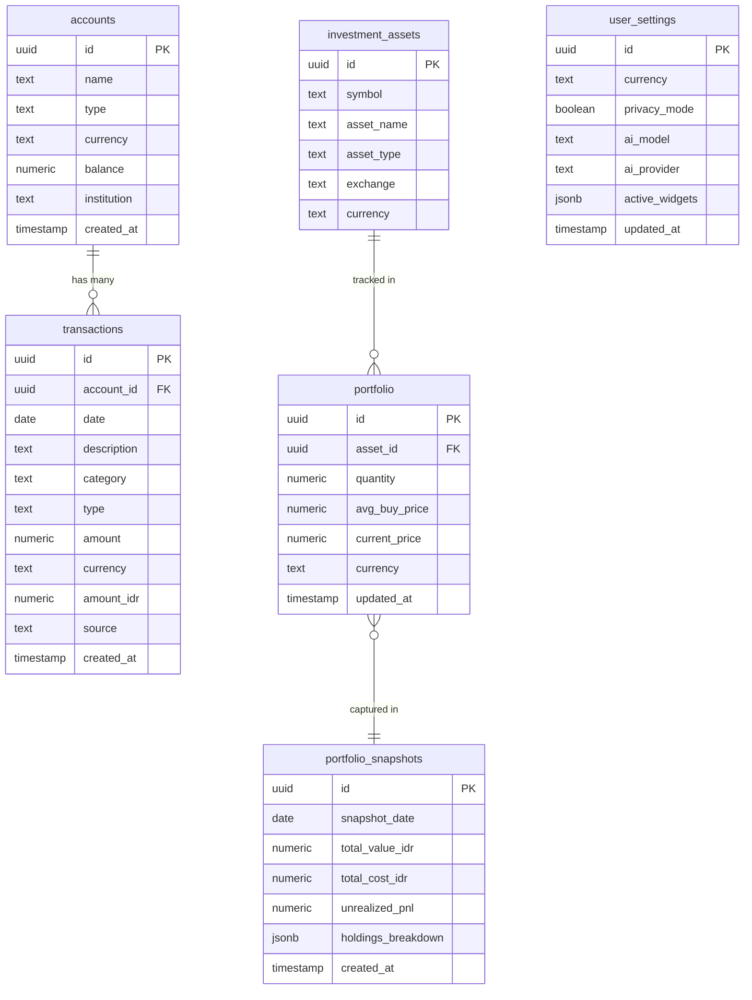

# 🗄️ Database Schema — WealthFolio

> ⚠️ **All values shown are fictional dummy data for portfolio demonstration purposes only.**

## Entity Relationship Diagram (ERD)



---

## Table Descriptions

### `accounts`
Stores all financial accounts (bank, e-wallet, investment).

| Column | Type | Description |
|---|---|---|
| `id` | UUID | Primary key |
| `name` | TEXT | Account label (e.g., "BCA Savings", "Taiwan Bank") |
| `type` | TEXT | `bank`, `ewallet`, `investment`, `cash` |
| `currency` | TEXT | Primary currency (IDR, NTD, USD) |
| `balance` | NUMERIC | Current balance in account currency |
| `institution` | TEXT | Bank or institution name |

**Dummy Example:**
```sql
INSERT INTO accounts VALUES 
  ('...', 'Taiwan Bank - NTD', 'bank', 'NTD', 142500.00, 'Taiwan Cooperative Bank'),
  ('...', 'BCA Indonesia', 'bank', 'IDR', 18500000.00, 'Bank Central Asia'),
  ('...', 'IBKR Investment', 'investment', 'USD', 4820.50, 'Interactive Brokers');
```

---

### `transactions`
Core table. All income, expenses, transfers.

| Column | Type | Description |
|---|---|---|
| `date` | DATE | Transaction date (YYYY-MM-DD) |
| `description` | TEXT | Natural language description |
| `category` | TEXT | Auto-classified category |
| `type` | TEXT | `INFLOW`, `OUTFLOW`, `TRANSFER` |
| `amount` | NUMERIC | Amount in original currency |
| `currency` | TEXT | Original currency |
| `amount_idr` | NUMERIC | Normalized to IDR (for unified analytics) |
| `source` | TEXT | `telegram`, `web`, `csv_import` |

**Dummy Example:**
```sql
INSERT INTO transactions (date, description, category, type, amount, currency, amount_idr) VALUES
  ('2024-04-22', 'Lunch at MRT station', 'Food', 'OUTFLOW', 95, 'NTD', 47500),
  ('2024-04-22', 'Monthly salary', 'Income', 'INFLOW', 85000, 'NTD', 42500000),
  ('2024-04-21', 'MRT commute', 'Transport', 'OUTFLOW', 28, 'NTD', 14000),
  ('2024-04-20', 'Netflix subscription', 'Entertainment', 'OUTFLOW', 390, 'NTD', 195000),
  ('2024-04-18', 'Rent payment', 'Rent', 'OUTFLOW', 12000, 'NTD', 6000000);
```

---

### `v_transactions_idr` (Materialized View)
Pre-aggregated view that normalizes all transactions to IDR for unified analytics.

```sql
-- Simplified schema of the view
CREATE VIEW v_transactions_idr AS
SELECT
  t.*,
  t.amount * COALESCE(fx.rate_to_idr, 1) AS amount_idr_calculated,
  DATE_TRUNC('month', t.date) AS month_bucket,
  EXTRACT(DOW FROM t.date) AS day_of_week
FROM transactions t
LEFT JOIN fx_rates fx ON fx.from_currency = t.currency AND fx.to_currency = 'IDR'
WHERE t.deleted_at IS NULL;
```

---

## Key Design Decisions

1. **IDR as base currency** — All monetary values normalized to IDR for consistent aggregation across multi-currency accounts
2. **Soft deletes** — `deleted_at` column instead of hard delete for audit trail
3. **Source tracking** — Every transaction records its input source (telegram bot, web, CSV)
4. **Snapshot pattern** — Daily portfolio snapshots enable historical P&L charting without expensive recalculation
